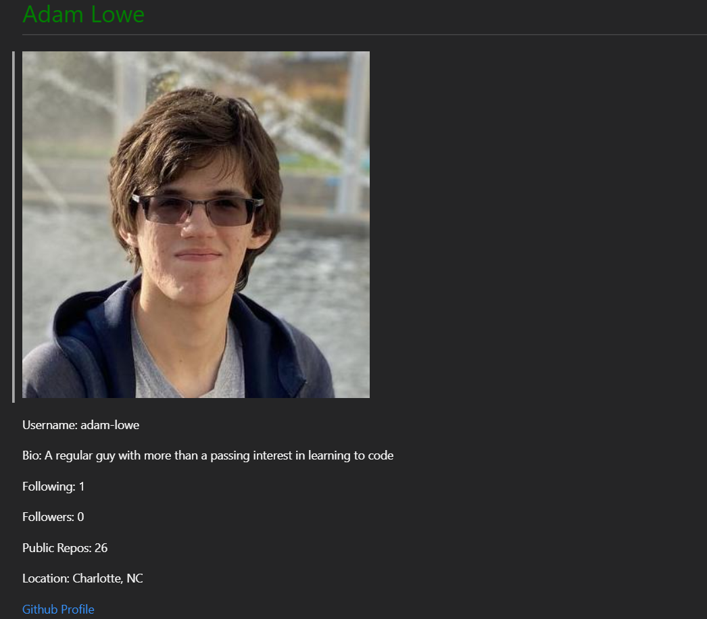

# Homework 6 - Weather Dashboard

This repo is for the UNCC coding bootcamp's Seventh homework assignment

## Instructions

Create a node javascript program that asks for github username and favorite color, then generates a markdown file that contains the profile information on the github user that was given, as well as coloring the name by favorite color given

## Gif and Screenshot

   
   
